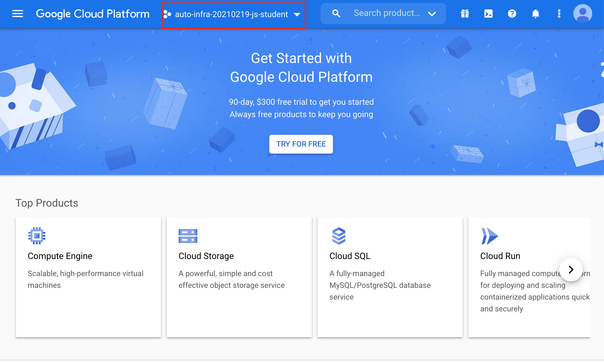
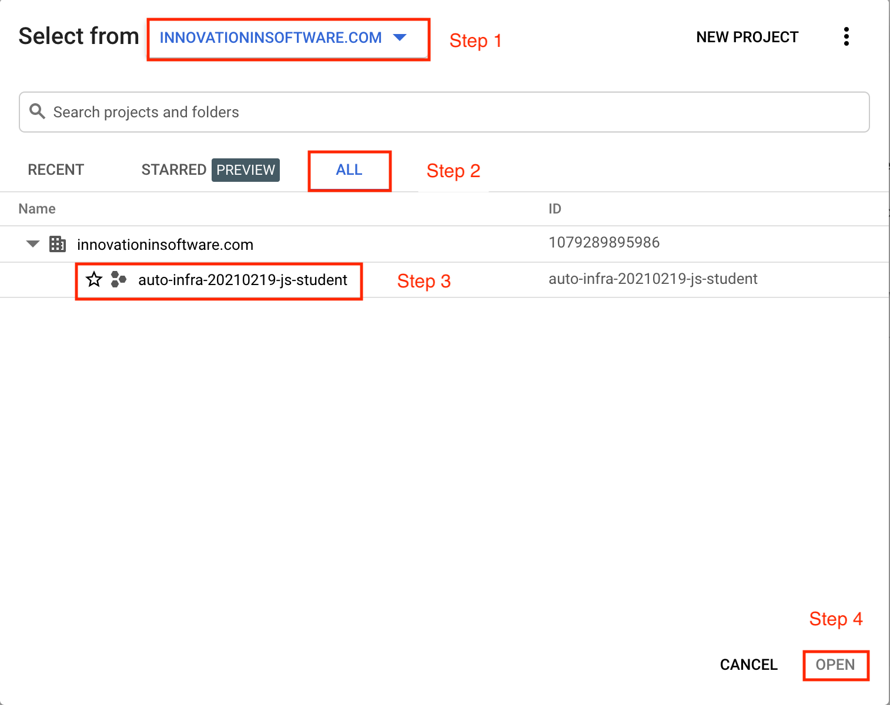

# Terraform on GCP
In this lab you will use Terraform to create a virtual machine on GCP, automate SSH access to it and install some packages.

Start by logging in to the [GCP Console](https://console.cloud.google.com) and selecting the project provided by the instructor. 

Step 1: 


Step 2: 



Launch the Cloud Shell by clicking the terminal icon to the right of the search bar.


## Enable Compute API
```
gcloud services enable compute.googleapis.com
```
**NOTE:** This may appear to hang, just wait a few minutes and it should complete.

## Create working directory
Create a new directory, which we'll use for future labs.
```
mkdir -p $(date +%Y%m%d)/terraform
```

Enter new directory
```
cd $_
```

## Describe VM instance
*Terraform allows you to describe the desired state of your infrastructure and makes sure your desired state meets the actual state.*

Terraform uses **resources** to describe different infrastructure components. If you want to use Terraform to manage some infrastructure component, you should first make sure there is a resource for that component for that particular platform.

Let's use Terraform syntax to describe a VM instance that we want to be running.

Create a Terraform configuration file called `main.tf` inside the `terraform` directory with the following content:

```terraform
resource "google_compute_instance" "demo" {
  name         = "demo-instance"
  machine_type = "f1-micro"
  zone         = "us-west1-a"

  # boot disk specifications
  boot_disk {
    initialize_params {
      image = "ubuntu-os-cloud/ubuntu-1804-lts" 
    }
  }

  # networks to attach to the VM
  network_interface {
    network = "default"
    access_config {} // use ephemeral public IP
  }
}
```

Here we use [google_compute_instance](https://www.terraform.io/docs/providers/google/r/compute_instance.html) resource to manage a VM instance running in Google Cloud Platform.

## Define Resource Provider
One of the advantages of Terraform over other alternatives like [CloudFormation](https://aws.amazon.com/cloudformation/?nc1=h_ls) is that it's `cloud-agnostic`, meaning it can work with many different cloud providers like AWS, GCP, Azure, or OpenStack. It can also work with resources of different services like databases (e.g., PostgreSQL, MySQL), orchestrators (Kubernetes, Nomad) and [others](https://www.terraform.io/docs/providers/).

This means that Terraform has a pluggable architecture and the pluggable component that allows it to work with a specific platform or service is called  a **provider**.

So before we can actually create a VM using Terraform, we need to define a configuration of a [google cloud provider](https://www.terraform.io/docs/providers/google/index.html) and download it on our system.

Create another file inside `terraform` folder and call it `providers.tf`. Put provider configuration in it:

```terraform
provider "google" {
  project = "<your gcp project>"
  region  = "us-west1"
}
```

Make sure to change the `project` value in provider's configuration above to your project's ID. You can get your default project's ID by running the command:

```
$ gcloud config list project
```

Now run the `init` command inside `terraform` directory to download the provider:

```bash
$ terraform init
```

## Bring Infrastructure to a Desired State
Once we described a desired state of the infrastructure (in our case it's a running VM), let's use Terraform's `plan` feature to confirm what will be created:

```bash
$ terraform plan
```

You should see output showing that Terraform will create a virtual machine and attach it to the `default` network.

If everything looks good in the above output apply the desired state:
```bash
terraform apply
```

After Terraform ran successfully, use a gcloud command to verify that the machine was indeed launched:

```bash
$ gcloud compute instances list
```

## Extend configuration
We did provisioning via Terraform, but we can also install some packages using GCP metadata scripts. Below is an example of modifying the metadata startup script with Terraform.

```terraform
// Update metadata startup script to install some packages
 metadata_startup_script = "sudo apt-get update; sudo apt-get install -yq build-essential python3-pip rsync nginx; pip3 install flask"
```

To access our new instance we need to inject an SSH key.

Create an SSH keypair

```bash
ssh-keygen -f ~/.ssh/tf-key
```

Now add a metadata field to the instance configuration to inject the SSH key.

```terraform
resource "google_compute_instance" "demo" {
 ...
metadata = {
   ssh-keys = "ubuntu:${file("~/.ssh/tf-key.pub")}"
 }
}

```

Now run `terraform validate` to check the syntax. If it passes run `terraform plan` to confirm Terraform will update to the desired state.

If everything looks good, apply the changes with `terraform apply`

> An execution plan has been generated and is shown below.  
> Resource actions are indicated with the following symbols:  
> ~ update in-placeTerraform will perform the following actions:~ google_compute_instance.default  
> metadata.%:       "0" => "1"  
> …Apply complete! Resources: 0 added, 1 changed, 0 destroyed.  
At this point you have successfully used Terraform to create a new GCP instance with an SSH key so you can access it. However, to access the VM you must use `gcloud` or the console to find out the IP of the VM.

Let's fix that by adding an `output` to our configuration, which will output the IP address of the VM after it is created.

```terraform
output "ip" {
  value = google_compute_instance.demo.network_interface.0.access_config.0.nat_ip
}
```

After adding the metadata for SSH key and the `output` for VM IP your `main.tf` should look like:

```terraform
resource "google_compute_instance" "demo" {
  name         = "demo-instance"
  machine_type = "f1-micro"
  zone         = "us-west1-a"
  metadata = {
   ssh-keys = "ubuntu:${file("~/.ssh/tf-key.pub")}"
}

  # boot disk specifications
  boot_disk {
    initialize_params {
      image = "ubuntu-os-cloud/ubuntu-1804-lts" 
    }
  }
  
  // Update metadata startup script to install some packages
 metadata_startup_script = "sudo apt-get update; sudo apt-get install -yq build-essential python3-pip rsync nginx; pip3 install flask"

  # networks to attach to the VM
  network_interface {
    network = "default"
    access_config {} // use ephemaral public IP
  }
}

resource "google_compute_firewall" "demo" {
  name    = "allow-demo-tcp-80"
  network = "default"
  allow {
    protocol = "tcp"
    ports    = ["80"]
  }
  source_ranges = ["0.0.0.0/0"]
}

output "ip" {
  value = google_compute_instance.demo.network_interface.0.access_config.0.nat_ip
}

```

Tell Terraform to apply the changes to bring the actual infrastructure state to the desired state we described:

```bash
$ terraform apply
```

You should see the public IP of the VM we created.

Verify that you can ssh to the instance using the private key.
```bash
ssh -i ~/.ssh/tf-key ubuntu@$(terraform output ip)
```

Also note, that during this Terraform run, no resources have been created or changed, which means that the actual state of our infrastructure already meets the requirements of a desired state.

## Conclusion
In this lab, you saw in its most obvious way the application of Infrastructure as Code practice.

We used `code` (Terraform configuration syntax) to describe the `desired state` of the infrastructure. Then we told Terraform to bring the actual state of the infrastructure to the desired state we described.

With this approach, Terraform configuration becomes `a single source of truth` about the current state of your infrastructure. Moreover, the infrastructure is described as code, so we can apply to it the same practices we commonly use in development such as keeping the code in source control, use peer reviews for making changes, etc.

All of this helps us get control over even the most complex infrastructure.

## Bonus lab
* Convert `zone`, `machine_type` and `image` to variables defined in `variables.tf`.

Destroy the resources created by Terraform:
```bash
$ terraform destroy
```

## Lab Complete